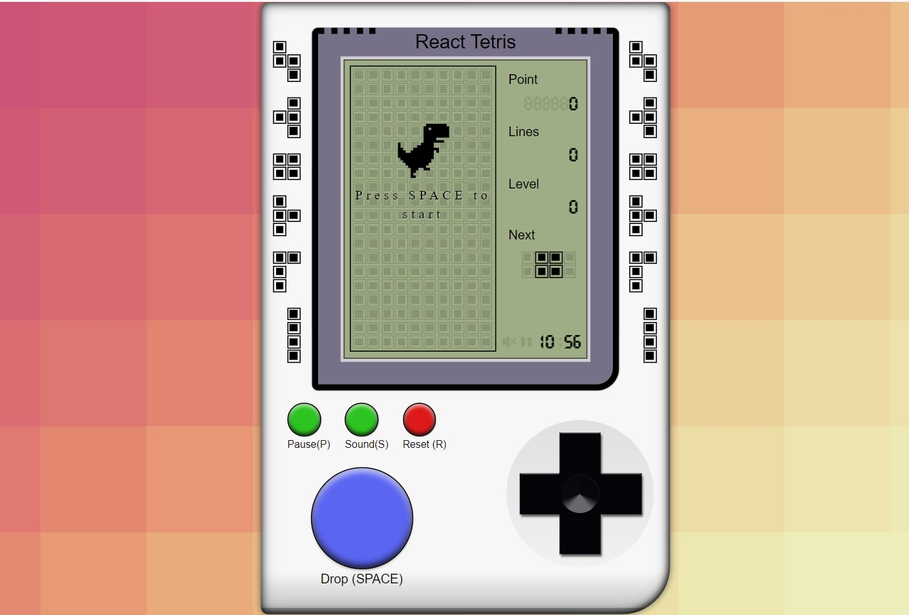

# TETRIS REACT

The classic Tetris game, reimagined and built with modern web technologies:

- **Framework:** [React](https://reactjs.org/)
- **State Management:** [Zustand](https://github.com/pmndrs/zustand)
- **Styling:** [Styled Components](https://styled-components.com/)
- **Build Tool:** [Vite](https://vitejs.dev/)

## Overview

Experience the nostalgia of the iconic Tetris game in a modern web environment. This project utilizes React for efficient component-based development, Zustand for state management, Styled Components for styling, and Vite as the build tool for a fast development experience.

## Features

- Responsive design for various screen sizes.
- State-of-the-art state management with Zustand.
- Stylish and customizable UI using Styled Components.
- Fast development and optimized builds with Vite.

Feel free to clone, modify, and explore the source code to understand the implementation details and enhance your React and game development skills!

---

*Disclaimer: This project is for educational and entertainment purposes, paying tribute to the classic Tetris game.*
